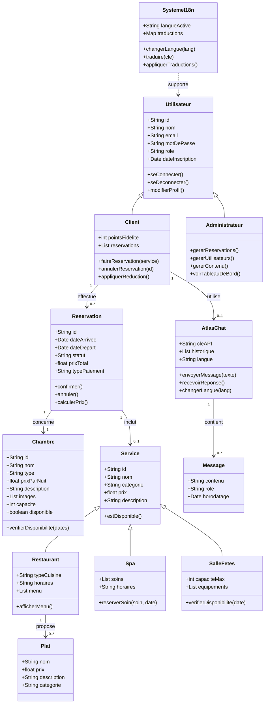
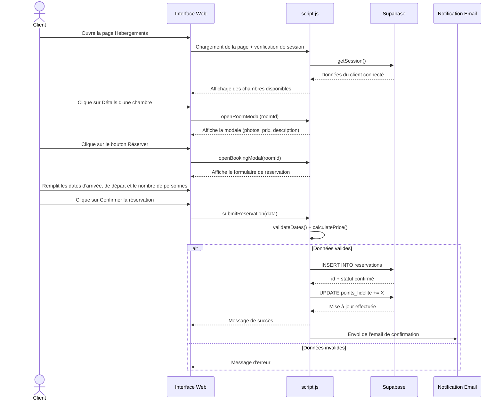
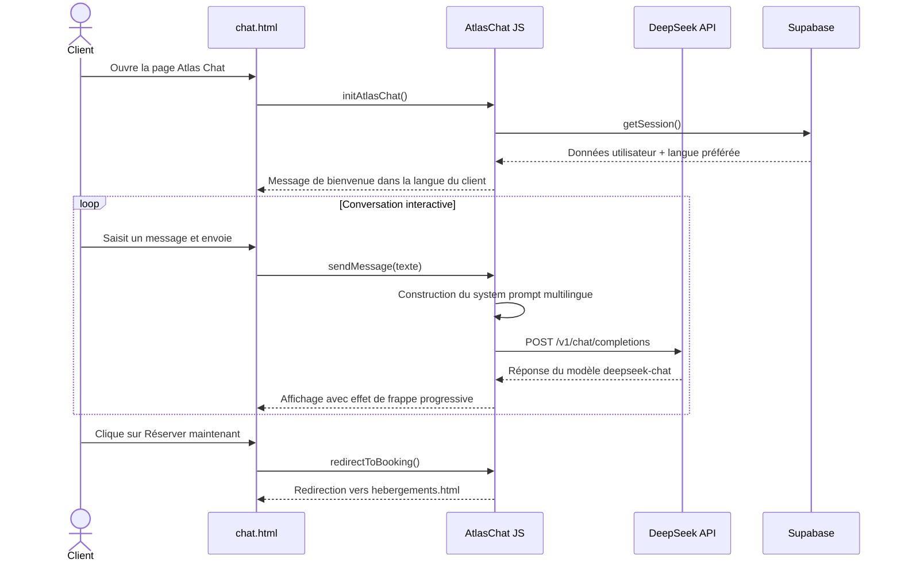
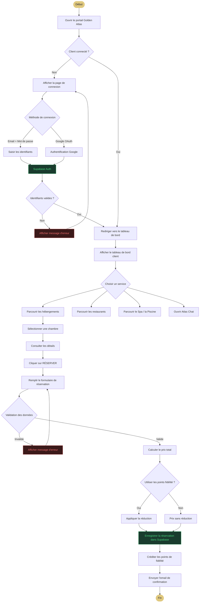
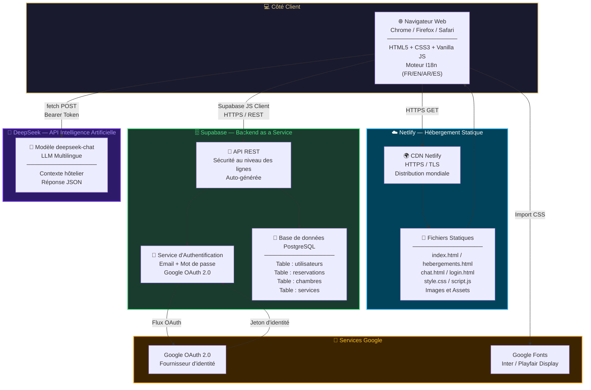

# Diagrammes UML — Portail Hôtelier Golden Atlas
## Projet de Fin d'Études — PFE

---

## 1. Diagramme de Cas d'Utilisation

```mermaid
flowchart TD
    Visiteur(["👤 Visiteur non inscrit"])
    Client(["👤 Client inscrit"])
    Admin(["🛡️ Administrateur"])
    IA(["🤖 Atlas Chat AI\nDeepSeek API"])
    DB(["🗄️ Base de données\nSupabase"])

    UC1["Parcourir le contenu du site"]
    UC2["Changer la langue de l'interface\nFR / EN / AR / ES"]
    UC3["Créer un compte"]
    UC4["Se connecter\nEmail ou Google OAuth"]
    UC5["Réserver une chambre ou un service"]
    UC6["Consulter mes réservations"]
    UC7["Annuler une réservation"]
    UC8["Utiliser les points de fidélité"]
    UC9["Discuter avec Atlas Chat"]
    UC10["Parcourir les menus et galeries"]
    UC11["Gérer toutes les réservations"]
    UC12["Gérer les utilisateurs"]
    UC13["Gérer le contenu du site"]

    Visiteur --> UC1
    Visiteur --> UC2
    Visiteur --> UC3
    Visiteur --> UC4

    Client --> UC1
    Client --> UC2
    Client --> UC5
    Client --> UC6
    Client --> UC7
    Client --> UC8
    Client --> UC9
    Client --> UC10

    Admin --> UC11
    Admin --> UC12
    Admin --> UC13

    UC5 -.->|"«include»"| DB
    UC6 -.->|"«include»"| DB
    UC9 -.->|"«include»"| IA
    UC4 -.->|"«extend»"| UC5
    UC8 -.->|"«extend»"| UC5

    style Visiteur fill:#1a1a2e,color:#e0c97f,stroke:#e0c97f,stroke-width:2px
    style Client fill:#16213e,color:#e0c97f,stroke:#e0c97f,stroke-width:2px
    style Admin fill:#0f3460,color:#e0c97f,stroke:#e0c97f,stroke-width:2px
    style IA fill:#533483,color:#fff,stroke:#a78bfa,stroke-width:2px
    style DB fill:#1a3c2e,color:#4ade80,stroke:#4ade80,stroke-width:2px
```

**Description :** Ce diagramme présente les trois acteurs principaux du système (Visiteur, Client inscrit, Administrateur) ainsi que les deux acteurs secondaires (IA DeepSeek et Supabase). Il illustre les 13 cas d'utilisation identifiés, avec les relations d'inclusion et d'extension.

---

## 2. Diagramme de Classes

**Description :** Ce diagramme modélise la structure statique du système avec 12 classes. On distingue la hiérarchie d'héritage (Utilisateur → Client / Administrateur), la composition (AtlasChat contient des Messages) et la spécialisation (Service se spécialise en Restaurant, Spa et SalleFetes).

---

## 3. Diagramme de Séquence — Réservation d'une chambre

**Description :** Ce diagramme décrit le flux de réservation d'une chambre, depuis l'ouverture de la page jusqu'à la confirmation en base de données. Il met en évidence les interactions entre l'interface, la logique JavaScript et le backend Supabase, incluant la gestion des erreurs et la mise à jour des points de fidélité.

---

## 4. Diagramme de Séquence — Concierge IA Atlas Chat

**Description :** Ce diagramme illustre le fonctionnement du concierge IA Atlas Chat. Le client interagit avec chat.html, qui transmet les messages à l'API DeepSeek via des requêtes HTTP sécurisées. Le contexte système est construit dynamiquement selon la langue détectée via Supabase.

---

## 5. Diagramme d'Activité

**Description :** Ce diagramme couvre l'intégralité du parcours utilisateur : de l'ouverture du portail jusqu'à la confirmation finale de la réservation. Il modélise les points de décision critiques (authentification, validation des données, points de fidélité) et les chemins alternatifs en cas d'erreur.

---

## 6. Diagramme de Déploiement

**Description :** Ce diagramme représente l'architecture de déploiement du portail Golden Atlas. Les fichiers statiques sont hébergés sur Netlify avec un CDN mondial. Le backend repose entièrement sur Supabase (PostgreSQL + Auth + API REST). L'IA conversationnelle est fournie par l'API DeepSeek, et l'authentification sociale est gérée par Google OAuth 2.0.

---

## Tableau Récapitulatif

| # | Diagramme | Objectif | Éléments clés |
|---|-----------|----------|---------------|
| 1 | **Cas d'utilisation** | Rôles des acteurs et interactions | 3 acteurs, 13 cas, include/extend |
| 2 | **Classes** | Structure des données et relations | 12 classes, héritage, associations |
| 3 | **Séquence — Réservation** | Flux de réservation étape par étape | Client → UI → script.js → Supabase |
| 4 | **Séquence — Atlas Chat** | Flux de conversation IA | Client → DeepSeek API → Réponse |
| 5 | **Activité** | Logique métier et décisions | Login → Navigation → Réservation → Confirmation |
| 6 | **Déploiement** | Infrastructure et hébergement | Netlify + Supabase + DeepSeek + Google |

---

> **Note :** Tous les diagrammes sont basés sur les technologies réelles du projet :
> - **Frontend :** HTML5, CSS3, Vanilla JavaScript
> - **Hébergement :** Netlify CDN
> - **Backend :** Supabase (PostgreSQL + Auth)
> - **IA :** DeepSeek API
> - **Authentification :** Google OAuth 2.0
