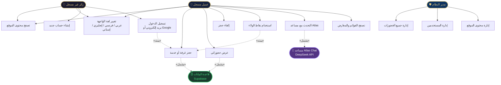
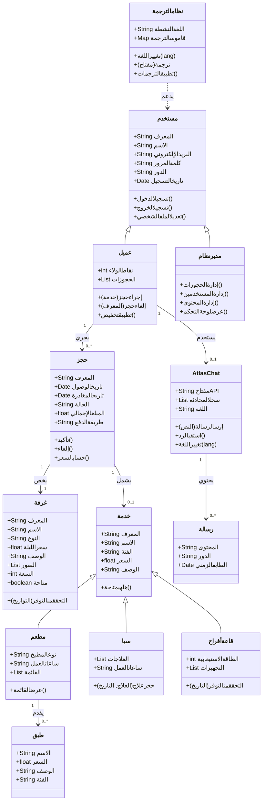
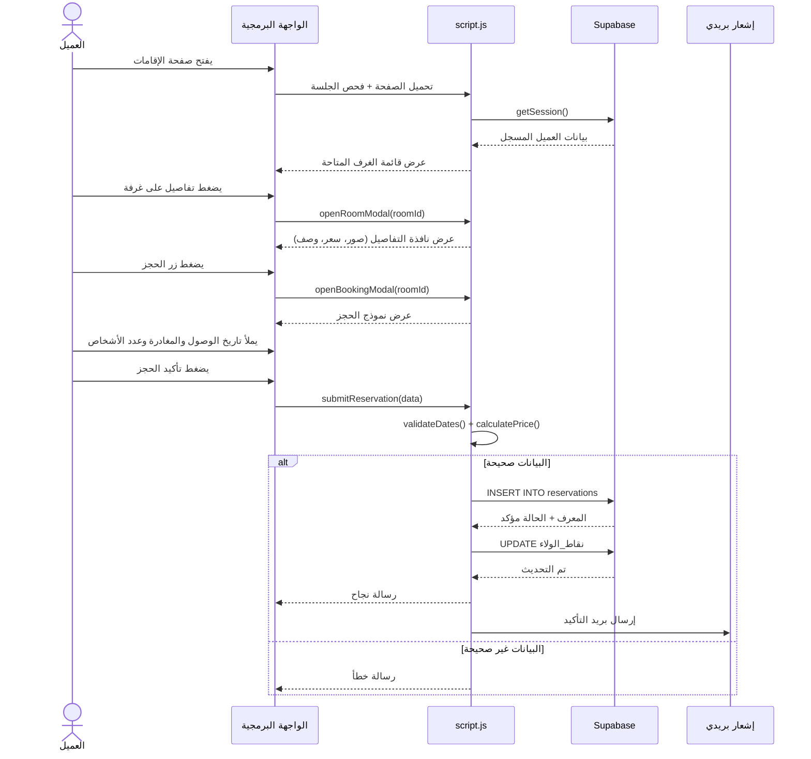
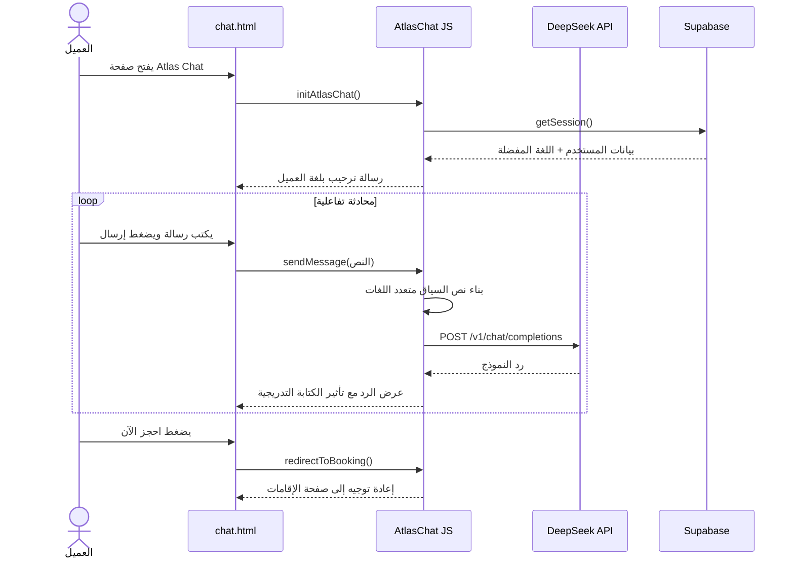
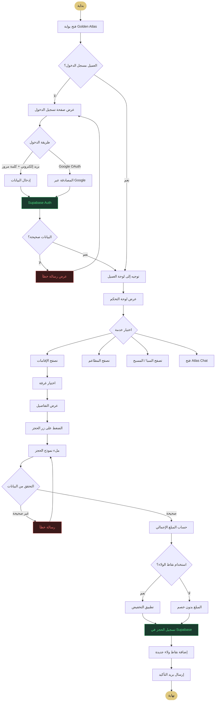
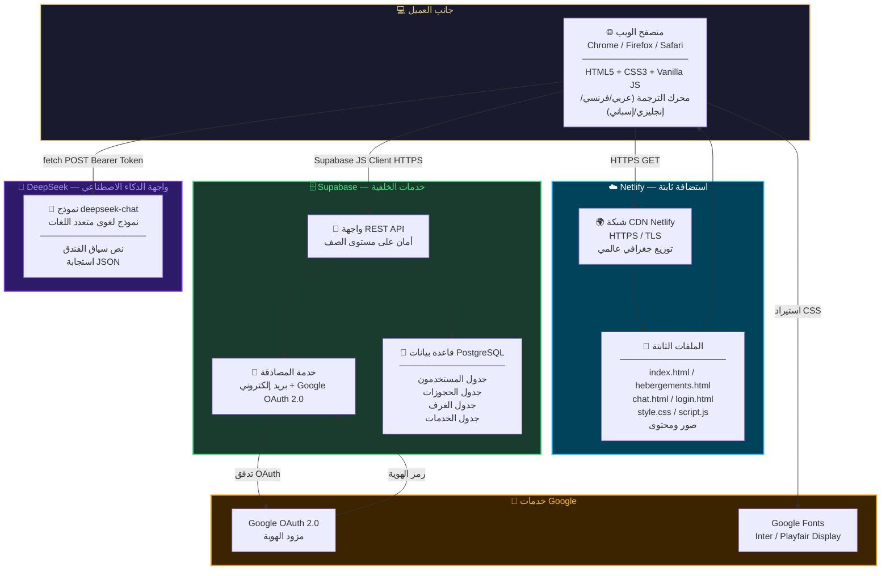

# مخططات UML — بوابة Golden Atlas الفندقية
## مشروع نهاية الدراسة — PFE

---

## 1. مخطط حالات الاستخدام

**الوصف:** يُظهر هذا المخطط الأطراف الثلاثة الرئيسية في النظام (زائر، عميل مسجل، مدير) إضافةً إلى الطرفين الثانويين (الذكاء الاصطناعي وقاعدة البيانات). يوضح 13 حالة استخدام مع علاقات الشمول والامتداد بينها.

---

## 2. مخطط الفئات

**الوصف:** يُجسّد هذا المخطط الهيكل الثابت للنظام بـ 12 فئة. يتضح التسلسل الهرمي (مستخدم ← عميل / مدير) والتركيب (AtlasChat يحتوي رسائل) والتخصص (الخدمة تتفرع إلى مطعم، سبا، قاعة أفراح).

---

## 3. مخطط التسلسل — حجز غرفة

**الوصف:** يصف هذا المخطط تدفق حجز الغرفة خطوةً بخطوة، من فتح الصفحة حتى التأكيد في قاعدة البيانات. يُبرز التفاعل بين الواجهة ومنطق JavaScript وخلفية Supabase، مع إدارة الأخطاء وتحديث نقاط الولاء.

---

## 4. مخطط التسلسل — مساعد Atlas Chat الذكي

**الوصف:** يوضح هذا المخطط آلية عمل المساعد الذكي Atlas Chat. يتفاعل العميل مع صفحة المحادثة التي ترسل الأسئلة إلى واجهة DeepSeek البرمجية عبر طلبات HTTP آمنة، وتُبنى نصائح السياق ديناميكيًا حسب لغة المستخدم المحفوظة في Supabase.

---

## 5. مخطط النشاط

**الوصف:** يغطي هذا المخطط المسار الكامل للمستخدم من فتح البوابة حتى التأكيد النهائي للحجز. يمثل نقاط القرار الحرجة (المصادقة، التحقق من البيانات، استخدام نقاط الولاء) والمسارات البديلة عند الأخطاء.

---

## 6. مخطط النشر

**الوصف:** يمثل هذا المخطط البنية التحتية الكاملة لنشر بوابة Golden Atlas. الملفات الثابتة مستضافة على Netlify بشبكة CDN عالمية. الخلفية تعتمد بالكامل على Supabase (قاعدة البيانات + المصادقة + واجهة REST). المساعد الذكي يعمل عبر DeepSeek API والمصادقة الاجتماعية تتم عبر Google OAuth 2.0.

---

## جدول الملخص

| # | المخطط | الهدف | العناصر الرئيسية |
|---|--------|--------|-----------------|
| 1 | **مخطط حالات الاستخدام** | أدوار الأطراف وحالات الاستخدام | 3 أطراف، 13 حالة، شمول/امتداد |
| 2 | **مخطط الفئات** | هيكل البيانات والعلاقات | 12 فئة، توارث، ارتباطات، اعتماديات |
| 3 | **مخطط التسلسل — الحجز** | تدفق الحجز خطوة بخطوة | عميل ← واجهة ← script.js ← Supabase |
| 4 | **مخطط التسلسل — Atlas Chat** | تدفق المحادثة مع الذكاء الاصطناعي | عميل ← DeepSeek API ← رد متعدد اللغات |
| 5 | **مخطط النشاط** | المنطق التجاري ونقاط القرار | تسجيل دخول ← تصفح ← حجز ← تأكيد |
| 6 | **مخطط النشر** | البنية التحتية والاستضافة | Netlify + Supabase + DeepSeek + Google |

---

> **ملاحظة:** جميع المخططات مبنية على التقنيات الفعلية للمشروع:
> - **الواجهة الأمامية:** HTML5, CSS3, Vanilla JavaScript
> - **الاستضافة:** Netlify CDN
> - **الخلفية:** Supabase (PostgreSQL + Auth)
> - **الذكاء الاصطناعي:** DeepSeek API
> - **المصادقة:** Google OAuth 2.0
